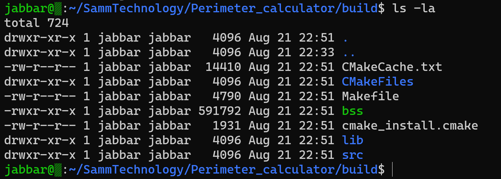

## Border Security System

A Terminal-based application to calculate the distance among points provided by Geographic coordinate system see [countries.geojson](https://github.com/JabSYsEmb/Perimeter_calculator/blob/main/src/data/countries.geojson).

## Prerequisite

- cmake 3.15 and above
- [JSON for Modern C++](https://github.com/nlohmann/json)
- c++17 

## Compilation of the project

At first, it's needed to change the path in [parser.hpp](https://github.com/JabSYsEmb/Perimeter_calculator/blob/main/src/parser.hpp#L12) to point to the json files and check if names are written correctly.

To compile the project, navigate into the folder where the project has been downloaded then write the following:

``` bash
mkdir build && cd build
cmake ..
make 
```
The project should be compiled and if you type ``` ls -la ``` you can see something similar to the screenshot below


Now, we need to execute the application in terminal as follwoing:
``` 
./bss -c [ISO_A3] -t [border/center]
ISO_A3         : country of interest {Default: All} [not case-sensitive]
border/center  : type of calculation {Default: border} [not case-sensitive]
```

for instances:
```
$ ./bss -c AZE -t cable
{
    "cable": 797773.9204358519,
    "iso_a3": "AZE",
    "name": "Azerbaijan"
}
$ ./bss -c AZE -t border
{
   "border": 2710587.9890285926,
   "iso_a3": "AZE",
   "name": "Azerbaijan"
}
```
After the application is terminated it will output corresponding data into a json file ```info.json``` in the same directory where it's executed. In order to print the content of the file out type the following:
``` bash
$ cat where/code/executed/info.json
```

for calcuating  ```border```'s length or sensing ```cable```'s length of the all countries at once, the following commends should be executed.
```bash
./bss -t border (for borders calculating)
./bss -t cable  (for cables calculating)
./cat info.json (for printing all values in terminal)
```

# Appendix
The distance among two points in this project is calculated by applying [Haversine Formula](https://en.wikipedia.org/wiki/Haversine_formula) since the Earth isn't flat ```¯\_(ツ)_/¯```. 


## Haversine Forumla

```
d                  : distance between the two points
r                  : radius of the sphere (of Earth in our case)
Theta(1), Theta(2) : are the latitude of point 1, point 2 (in radians)
lamda(1), lamda(2) : are the longitude of point 1, point 2 (in radians)
```
